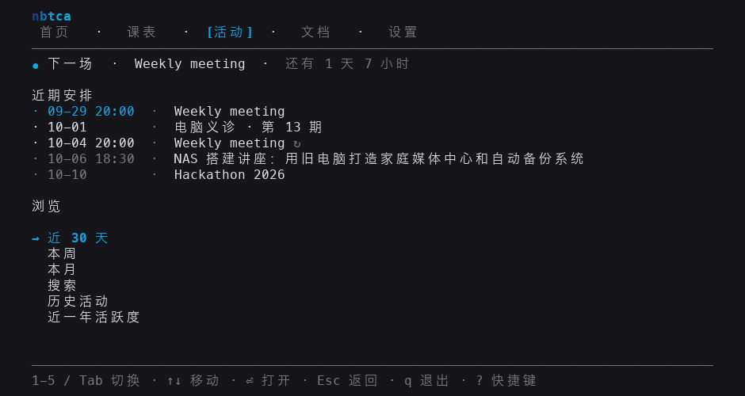

# NBTCA Prompt

Club events, the school calendar, your campus timetable, and the NBTCA knowledge
base in one terminal app. What you have loaded stays readable offline.

[](https://www.npmjs.com/package/@nbtca/prompt)
[](LICENSE)



## Install

Requires Node.js 20.12 or newer.

```bash
npm install --global @nbtca/prompt
nbtca
```

Or try it without installing: `npx @nbtca/prompt`.

## Interactive mode

`nbtca` opens a full-screen client. Press `1`–`5` or `Tab` to switch tabs, and
`?` to list every key.

- **Home**: today's classes and the next club events.
- **Schedule**: the current term, week, and next break. Log in to the campus
  system to see your timetable and export it to any calendar app as `.ics`.
- **Events**: a countdown to the next event, plus week and month views, search,
  history, and a one-year activity heatmap.
- **Docs**: read and search the knowledge base. It works even when GitHub is
  unreachable.
- **Settings**: language, icons, and colors.

## Commands

```text
nbtca events [--today|--week|--month] [--search=<q>] [--json]
nbtca schedule login|terms|export|logout
nbtca status [--watch]
nbtca docs
nbtca website|github|roadmap|repair [--open]
nbtca lang zh|en
nbtca update
```

`nbtca --help` lists every command and flag. Add `--plain` for output without
color.

Prompt never stores your password. A saved campus session gets user-only file
permissions. See [SECURITY.md](SECURITY.md).

## Development

```bash
npm ci
npm run check
```

## License

MIT
